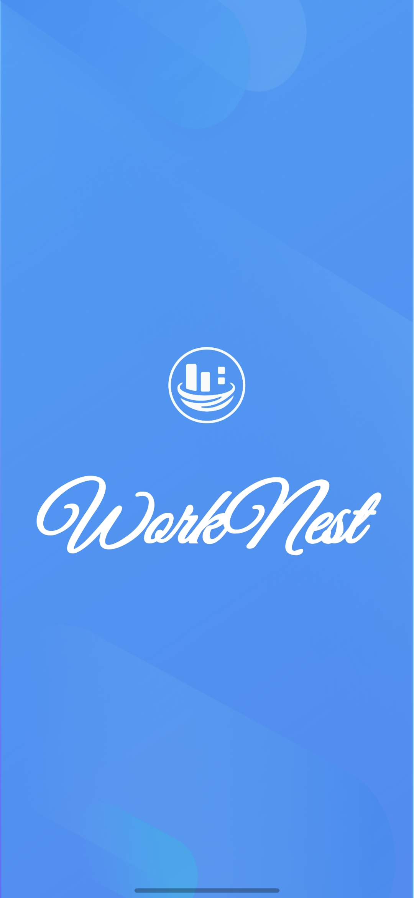
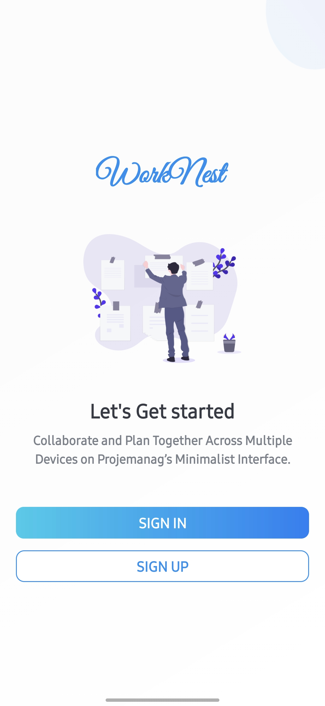
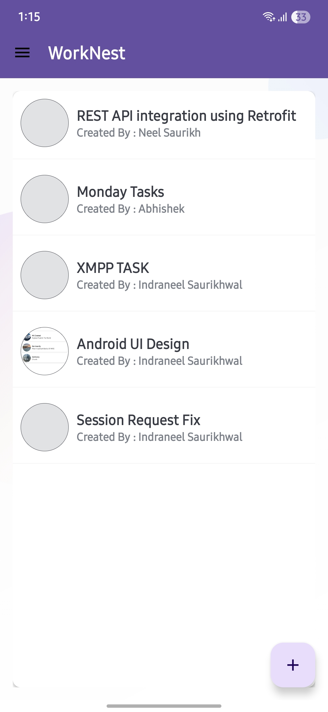
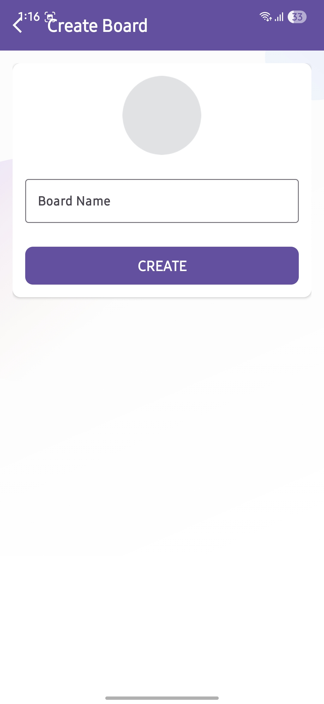
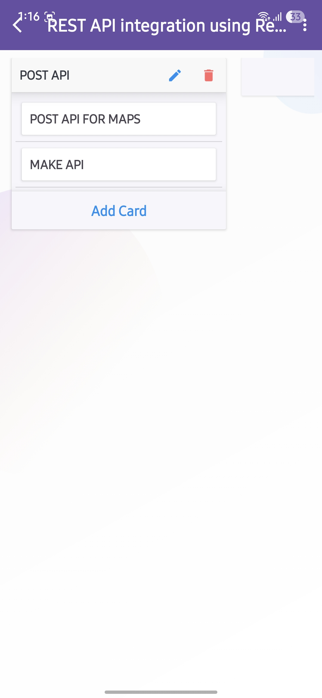
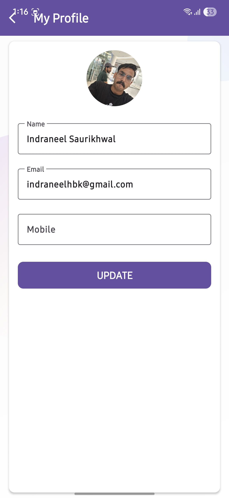
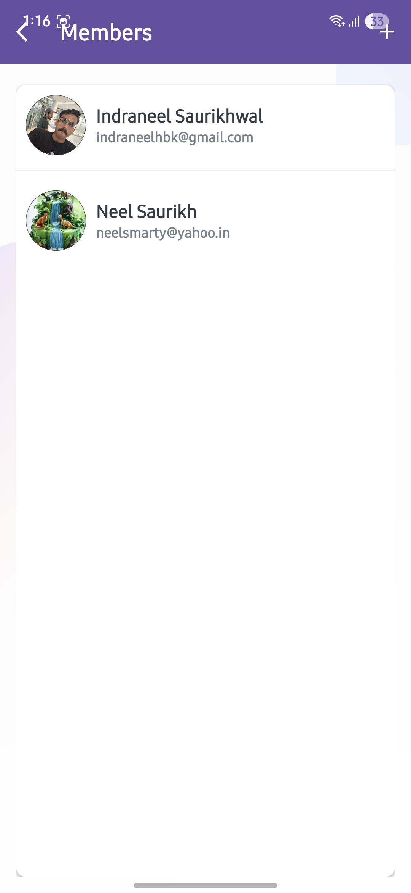

# WorkNest – A Trello Clone Android App

WorkNest is an Android application inspired by Trello. It helps users manage projects and tasks through boards, task lists, and cards, following the Kanban-style productivity method.

## ✨ Features

- ✅ User Authentication (Firebase Authentication)  
- ✅ Create, Update, Delete Boards  
- ✅ Add Task Lists within Boards  
- ✅ Add Cards within Task Lists  
- ✅ Assign Members to Boards and Cards  
- ✅ Upload Profile Pictures using Firebase Storage  
- ✅ Push Notifications (Firebase Cloud Messaging) (WIP)

## 📱 App Screenshots

### 🟣 Startup Flow

| <br>**Splash Screen** | <br>**Login Screen** |
|:-:|:-:|

---

### 🟢 Main Features

| <br>**Board List View** | <br>**Create Board** | <br>**Task List View** |
|:-:|:-:|:-:|

---

### 🛠️ User Settings & Members

| <br>**Edit Profile** | <br>**Members List** |
|:-:|:-:|


## 🚀 Tech Stack

- **Language:** Kotlin  
- **UI:** XML Layouts + ViewBinding  
- **Backend:** Firebase Firestore  
- **Storage:** Firebase Storage  
- **Notifications:** Firebase Cloud Messaging (FCM)  
- **Image Loading:** Glide  

## 🛠️ How to Run Locally

1. **Clone the repository**  
   ```bash
   git clone https://github.com/NeelSaurikh/WorkNest.git
